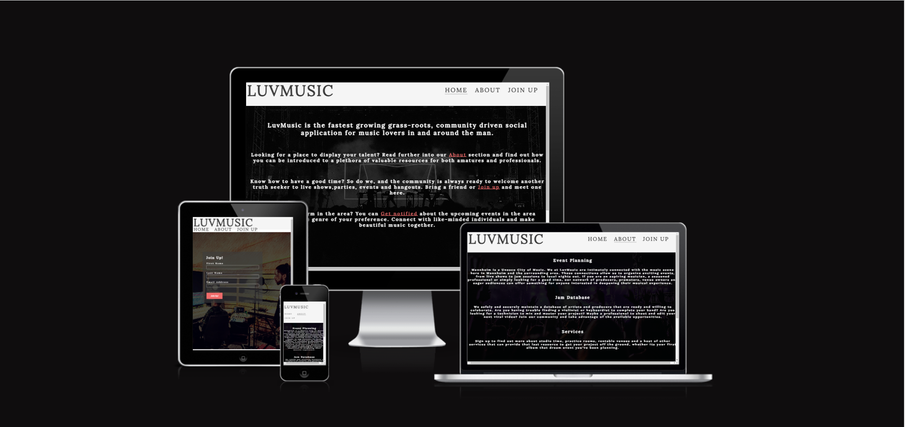
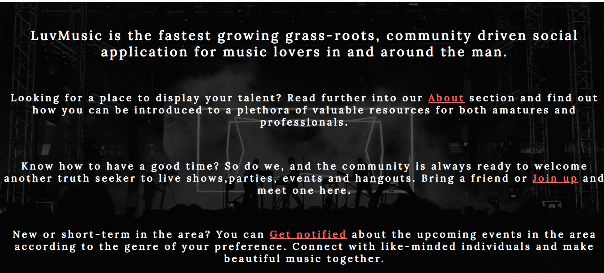
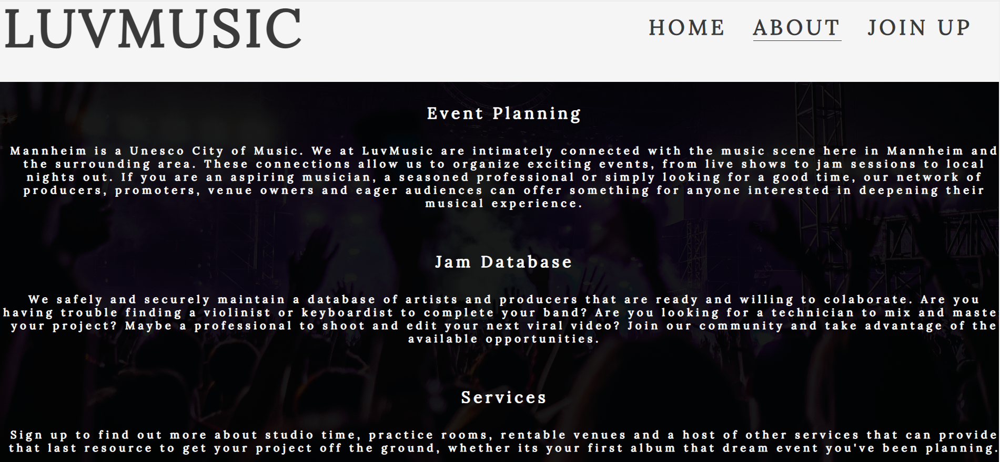
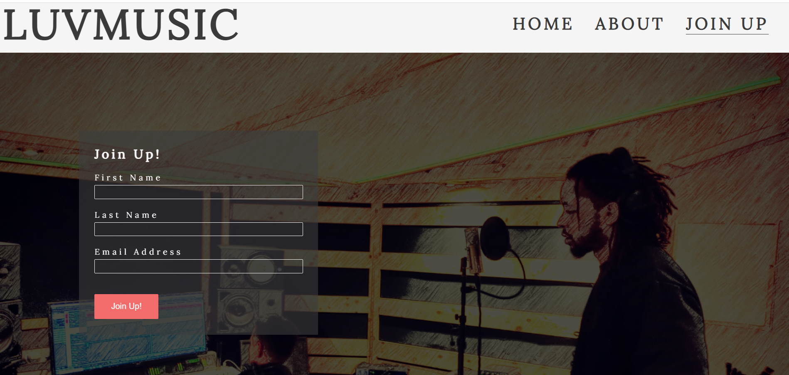
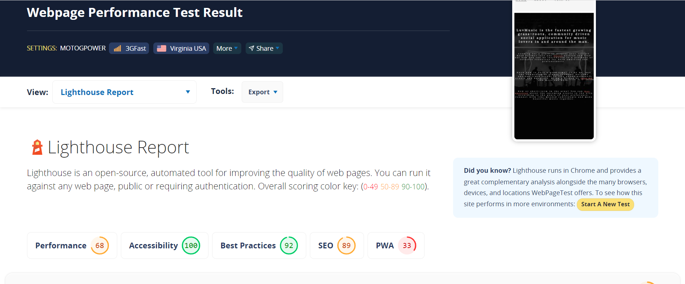

# LuvMusic
LuvMusic is a landing page where music enthusiasts in, around or planning to visit the Mannheim area can join  network of like minded individuals in order to share their love of music, whether it be at live shows, open mics or a local pub.

users of this website will find general information as to the offerings of the LuvMusic organization and input their name and email on the sign up sheet to be added to the member datatbase and mailing list. The site is targeted towards music lovers of all demographics.

# Features
* Navigation
  * Featured on the top left, the Logo can be found, informing the user as to what web-page they are viewing.
  * On the top right, a navigation bar with links to the About and Sign-up sections of the page.
  * The navigation bar provides an easy structure for the user to navigate through the pages of the site.
  

* The Header
  * Here the Header is used as a container for the Logo and Navigation bar.

* The background image
  * This feature acts as a kind of fixed Hero Image and scrolls as the user engages with the        initial calls to action on the landing page. This is to provide dynamics and also to begin calls to explore the page further.
  

* The Audio Player
 * the audio player is set to mute, but if engaged with using the embeded controls, the user may sample existing work from local artists.
 

* The Footer
 * The footer provides links to all social media accounts where the user can engage the team.
 

* About (page two)
 * Here the user will find more detailed information as to the usefulness of the LuvMusic community. It explains who the company targets and what value is being offered. 

 * The about page is structured in much the same way as the landing page for consistancy. There is also a scrolling background image and an audio player.
 

* Sign-up
 * On the third page there is a sign-up form that prompts the user to input first name, last name and addrress to that may join the community. Each input is required to submit.
 

# Testing
* I tested that this site works in multiple browsers, including Chrome and Safari.
* I confirmed that the site looks good, is responsive and functions on all standard screen sizes using amiresponsivedesign.is.
* I confirmed that all text are readable and easy to understand.
* I have confirmed that the form works, requires entries in every field and only accepts the email format in the email block. The submit button works.

## Bugs
### Solved Bugs
* After deploying the project and testing it, I found that the text required resizing. This I did.
* I also rfound aa broken link on the landing page. The link had an inaccurate href value. This was corrected.

## Validator Testing
* No errors were returned from the HTML W3C validator.
* No errors were returned from the CSS Jigsaw validator.
* The Lighthouse tect returned 100% accessibility.

## Unfixed Bugs
* No bugs

# Deployment
* The site was deployed to GitPages using the following steps:
 * Rename document (rogerwdavis.github.io)
 * Navigate to settings tab.
 * Navigate to pages.
 * From the source section dropdown, select main.
 * Save.

 The live link can be found here: [LuvMusic](https://rogerwdavis.github.io/index.html)

 # Credits
 * The Footer and a portion of the Header code was taken from the [Love Running](https://github.com/Code-Institute-Solutions/love-running-2.0-sourcecode/blob/main/01-getting-set-up/02-boilerplate/index.html) project
 
 * Form input and submit button CSS  were taken from the [Sign_Up](https://github.com/Code-Institute-Solutions/love-running-2.0-sourcecode/blob/main/01-getting-set-up/02-boilerplate/index.html) Challenge. 

